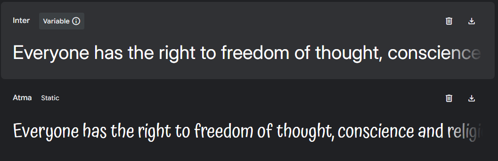

# Binge-Watchers

## Links

- [Live Preview](https://binge-watchers-guide-ad640513c9e7.herokuapp.com/) of deployed project.
- [GitHub](https://github.com/Richfletch92/BWGM)
- [Project Board](https://github.com/users/Richfletch92/projects/9)

## Table of Contents
- [Overview](#overview)
- [UX Design Process](#ux-design-process)
- [Key Features](#key-features)
- [Deployment](#deployment)
- [AI Implementation and Orchestration](#ai-implementation-and-orchestration)
- [Testing Summary](#testing-summary)
- [Technologies & Credits](#technologies--credits)
- [Future Enhancements](#future-enhancements)
- [Special Mention](#special-mention)

## Overview
Binge-Watchers is your ultimate destination for movie and TV series reviews, ratings, and recommendations. The platform allows users to explore detailed information about movies and TV series, submit reviews, and apply filters to find content that matches their preferences. I aim to use this website in the future to integrate with [Plex](https://www.plex.tv) so users can link their watch lists to my website. 

[Return to Contents](#table-of-contents)

## UX Design Process
- **Link to User Stories in GitHub Projects:**
  - [GitHub Projects Kanban Board](https://github.com/users/Richfletch92/projects/9)
  - I've added my user stories to a separate [document](readme/userstories.md).
- **Wireframes:**
  - [Wireframes](readme/wireframes.md) - Here are my initial designs for the website. I had originally planned to create a page for each individual season, however due to time constraints I was unable to do this. I plan to add this in the future. 
  - The design focuses on usability and accessibility for all users, including those using assistive technologies.
- **Entity Relationship Diagram**

   
  - I followed my ERDs very closely. There are additional tables which are currently not being used as these are for future developement. I have used parts of the season table, however there are more values being stored that were not used currently.
- **Design Rationale:**
  - Key design decisions include a clean layout, a consistent colour scheme and typography that adheres to accessibility guidelines (e.g., WCAG).
  - Considerations for users with disabilities include screen reader support and keyboard navigation.
- **Design Changes**
  - Although I have followed my designs quite closely some changes have been made due to user feedback and technical issues. I changed the login and registration pages from modals due to having issues getting the forms to work. I plan to implement this in the future. 
- **Colour Scheme**

  
  I followed [Plex's](https://www.plex.tv) colour scheme as to maintain continuity from Plex to my website. 
  - Jonquil: #f7c600ff;
  - Black: #000000ff;
  - Eerie-Black: #191919;
  - Davys-Gray: #505050;
  - Battleship-Gray: #919191;
  - White-Smoke: #f2f0f1;
  - White: #ffffff;
- **Fonts**

  
  I chose the font Atma for my Logo font and headings as a fun design/style to make my website more intriguing. I used Inter for its easy readability and sleek design. 
  - Logo-Font: 'Atma', cursive;
  - Primary-Font: 'Inter', sans-serif;

[Return to Contents](#table-of-contents)

## Key Features
- **Movie and TV Series Details:**
  - Fetches detailed information from the TMDb API, including images, release dates, runtime, and overviews.
  - Displays a brief overview of each movie and TV series to help users understand the premise.

- **User Reviews:**
  - Allows users to submit, edit, and delete reviews for movies and TV series.
  - Users can rate movies and TV series on a scale of 1 to 10.
  - Displays user reviews prominently on the movie and TV series pages.

- **Filtering Options:**
  - Users can filter content based on genre, release year, and rating.
  - Filtering options are available on both the movie and TV series pages.
  - Filters can be combined to narrow down results further.
  - Includes a "Clear Filters" button to reset all applied filters.

- **Search Functionality:**
  - Provides a search bar on the homepage and other relevant pages.
  - Users can search for movies and TV series by title.

- **Responsive Design:**
  - The website layout is fully responsive and adapts to different screen sizes.
  - Ensures a consistent and user-friendly experience across desktop, tablet and mobile devices.

- **Accessibility:**
  - Designed with accessibility in mind, adhering to WCAG guidelines.
  - Includes features such as screen reader support, keyboard navigation, and high contrast options.
  - Ensures that all interactive elements are accessible to users with disabilities.

- **Social Media Integration:**
  - Includes social media links in the footer for easy access to the project's social media pages.

- **User Authentication:**
  - Provides user registration and login functionality.
  - Ensures secure handling of user data with proper validation and error handling.
  - Users can reset their password via email. 

- **Admin Panel:**
  - Includes an admin panel for managing movies, TV series, and user reviews.
  - Allows administrators to approve or reject user reviews.
  - Provides tools for managing user accounts and site content.

- **Deployment and Hosting:**
  - Deployed on Heroku with environment variables for secure configuration.
  - Ensures that the deployed version matches the development version in functionality.
  - Includes steps for verifying and validating the deployed version.

- **Inclusivity Notes:**
  - Features are designed to address the needs of diverse users, including those with SEND.
  - Ensures that the platform is inclusive and accessible to all users.

[Return to Contents](#table-of-contents)

## Deployment
- **Platform:** Heroku
- **High-Level Deployment Steps:** 
  1. Clone the repository and open in your IDE
  2. Create env.py and .env files
  3. Add the following variables to env.py
    - SECRET_KEY
    - DEBUG
    - ALLOWED_HOSTS (ensure you add your local address and .herokuapp.com)
    - DATABASE_URL
    - EMAIL_HOST_USER
    - EMAIL_HOST_PASSWORD
  4. Add the following variables to .env
    - TMDB_API_KEY
    - TMDB_BASE_URL
  5. Create a venv and run the following commands
    - pip install -r requirements.txt
    - python manage.py makemigrations
    - python manage.py migrate
    - python manage.py createsuperuser
    - python manage.py fetch_data
    - python manage.py collectstatic
    - git add, commit and push
  6. Open Heroku and create a new app
  7. Connect your GitHub project to the app. 
  8. Click on settings and reveal config vars. Then enter all hidden variables from your env.py
  9. You can now deploy your project. 

[Return to Contents](#table-of-contents)

## AI Implementation and Orchestration

### Use Cases and Reflections:

  - **Code Creation:** 
    - Reflection: I used Co-pilot through the majority of my project by using inline editing and chat. I had a lot of problems with Co-pilot consistently trying to override code that wasn't needed. I also had issues with the code being overly complex or not doing what I'd asked it to create. I found ChatGPT to be more helpful in a lot of instances where Co-pilot was failing. I used a mix of question-and-answer prompts and multi-step prompts when getting AI to assist in my code creation. Sometimes Co-pilot would need further info as the original prompts wouldn't create what I'd asked it to do. 

    - Examples: When creating my fetch_data and utils I started using Co-pilot, however I couldn't get Co-pilot to write the code effectively and get it to work. When asking ChatGPT to write the same functions the code worked straight away with little to no editing required. Had I used ChatGPT straight away I would have saved myself a considerable amount of time.
    
  - **Debugging:** 
    - Reflection: Co-pilot was excellent for spotting smaller bugs and helped identify an issue causing overflow on the right-hand side of my screen, whilst Co-pilot couldn't identify the issue. It recommended adding a wildcard selector which added a border to each element. This allowed me to identify that my footer was overflowing. I did have a few issues with Co-pilot delaying me with debugging. When I was trying to implement users being able to edit their own reviews, I had an issue with the review form not prefilling. This was due to my JavaScript file not being correctly linked to the HTML file. There was a small typo in the file name set as script.js and not scripts.js. Co-pilot advised some extensive and over-the-top fixes but didn't advise once about the potential typo. I spent 2-3 hours trying to fix the issue using Co-pilot. In conclusion, I have learned that relying on AI too heavily instead of manual testing can be less time effective.

  - **Performance and UX Optimisation:** 
    - Reflection: Although I came up with the main design for the website, Co-pilot was useful when it came to creating forms using my original designs as templates. This saved me a considerable amount of time, allowing me to use my time more effectively. 

- **Overall Impact:**
  - AI tools streamlined repetitive tasks, enabling focus on high-level development.
  - Efficiency gains included faster debugging, comprehensive testing, and improved code quality.
  - Challenges included contextual adjustments to AI-generated outputs, AI not always detecting what is causing the underlying issues and some AI not always being effective as others. 
  - As stated above, I think AI can be very effective however it's not always the most reliable which can have negative impacts if relied on too heavily. I found that manual testing can sometimes be more time effective than asking AI to fix your code. 

[Return to Contents](#table-of-contents)

## Testing Summary
- **Verification and Validation:**
  - Steps taken to verify the deployed version include functionality checks and accessibility tests.
  - Use of [Lighthouse](https://github.com/GoogleChrome/lighthouse) to check performance and accessibility. Accessibility is excellent scoring 100 on every page. Performance could have been better on mobile. Main issues with performance were due to the images improted from TMDb API. [Results](readme/lighthouse.md)
  - [W3C HTML Validator](https://validator.w3.org/) used to validate HTML. All results passed except the registration page, which unfortunately was out of my control. This was due to AllAuth's forms having issues which are shown in my [Results](readme/html.md)
  - [W3C CSS Validator](https://jigsaw.w3.org/css-validator/) used to validate CSS [Results](readme/css.md)
  - [JSHint JavaScript Validator](https://jshint.com/) used to validate JS [Results](readme/js.md)
  - [CI Python Linter Validator](https://pep8ci.herokuapp.com/) used to validate Python [Results](readme/python.md)
- **Security Measures:**
  - Use of environment variables for sensitive data.
  - Ensured DEBUG mode is disabled in production.
- **Manual Testing:**
  - **Overview:** Testing was continuously done during development, AI was used to check through code consistently to spot any typos and missing closing elements. All code was tested with validators to ensure there wasn't any issues with the code. 
  - **Devices and Browsers Tested:** Tested on various Android and Apple devices. Friends and family tested on a variety of mobile devices and computers. The browsers used were Chrome, Edge and Safari. I also tested using dev tools to resize the screen, ensuring my website was responsive.
  - **Features Tested:** CRUD operations, navigation, filtering, review submission, user registration, password resetting and responsiveness.
  - **Results:** All features worked as expected. There were originally some issues with my unapproved reviews counting towards the total review count and average rating. I fixed this issue by having Python check whether the review has been approved before counting it towards the mentioned values. Users were also able to submit multiple reviews including the same content. To fix this used Python to check whether the content of the review had already been submitted and gave an appropriate error message. 

[Return to Contents](#table-of-contents)

## Technologies & Credits
- [HTML](https://en.wikipedia.org/wiki/HTML5) Used for main structure of the website.
- [CSS](https://en.wikipedia.org/wiki/CSS) Used for styling and design.
- [Bootstrap](https://getbootstrap.com/) Used for layout through Bootstrap's grid system.
- [JavaScript](https://en.wikipedia.org/wiki/JavaScript) Used for added functionality to my reviews and filters.
- [Python](https://en.wikipedia.org/wiki/Python_(programming_language)) Used for the main functionality of my website.
- [Django](https://en.wikipedia.org/wiki/Django_(web_framework)) Used for the main backend framework for website along with Python. 
- [GitHub](https://github.com/dashboard) Used to host my repository.
- [Heroku](https://www.heroku.com/) Used for deployment and hosting my website.
- [VS Code](https://code.visualstudio.com/) Used for the main IDE for developing my project.
- [Co-Pilot](https://copilot.microsoft.com/) The primary AI used for assisting in developing my project. It was used through VS Code with a built-in extension from GitHub.
- [ChatGPT](https://chatgpt.com/) The secondary AI used for further consulting when Co-Pilot was failing to help or providing overly complex code.
- [Balsamiq](http://balsamiq.com/) Used for creating and designing my wireframes.
- [Google Fonts](https://fonts.google.com/) Used for retrieving font designs for my website.
- [Font Awesome](https://fontawesome.com/) Used for social media icons etc.
- [Favicon.io](https://favicon.io/) Used for creating my favicons. 
- [ImageColorPicker](https://imagecolorpicker.com/) Used for extracting the hex code from Plex's website.
- [TMDb](https://www.themoviedb.org/?language=en-GB) Used for API to extract all images and details relating to movies and series. 

[Return to Contents](#table-of-contents)

## Future Enhancements
- Enhance the filtering options to include more criteria.
- Improve the design and layout based on user feedback.
- Add season pages and episode information (models have been added for this functionality already and is reflected in my ERDs)
- Give users the ability to add comments to reviews (models have been added for this functionality already and is reflected in my ERDs)
- Add further functionality to reviews by giving options to like/dislike reviews (models have been added for this functionality already and is reflected in my ERDs)
- Allow users to add movies/series and pull relevant information using API 
- Add ability to login using social media
- Move the registration and login/logout pages into a modal
- Plex API integration 

[Return to Contents](#table-of-contents)

## Special Mention
- I also wanted to leave a thank you note to Charles Tack from my Bootcamp who did a thorough test of my website and gave me some great ideas for improvements.

[Return to Contents](#table-of-contents)